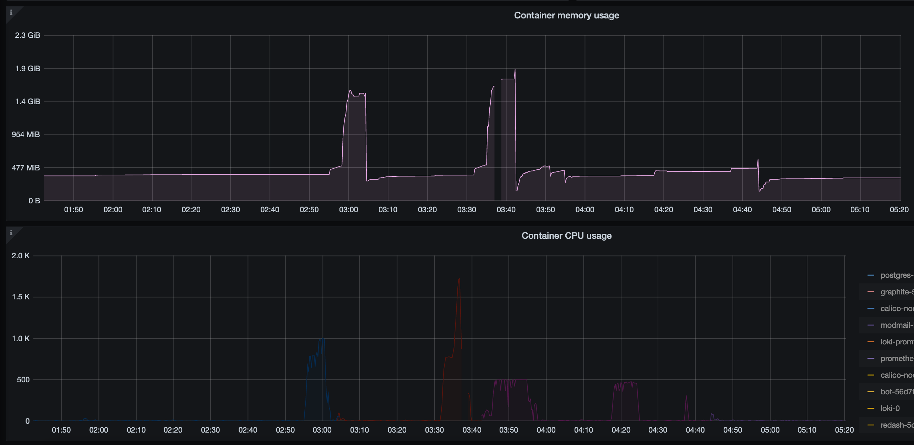
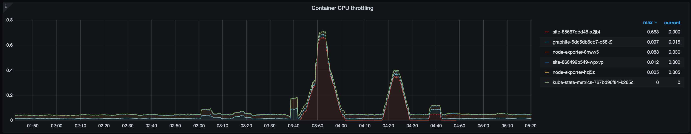

# Django site CPU/RAM exhaustion outage

At 03:01 UTC on Tuesday 12th January we experienced a momentary outage
of our PostgreSQL database, causing some very minor service downtime.

<!-- more -->

## :warning: Leadup

*List the sequence of events that led to the incident*

We deleted the Developers role which led to a large user diff for all
the users where we had to update their roles on the site.

The bot was trying to post this for over 24 hours repeatedly after every
restart.

We deployed the bot at 2:55 UTC on 12th January and the user sync
process began once again.

This caused a CPU & RAM spike on our Django site, which in turn
triggered an OOM error on the server which killed the Postgres process,
sending it into a recovery state where queries could not be executed.

Django site did not have any tools in place to batch the requests so was
trying to process all 80k user updates in a single query, something that
PostgreSQL probably could handle, but not the Django ORM. During the
incident site jumped from it's average RAM usage of 300-400MB to
**1.5GB.**



RAM and CPU usage of site throughout the incident. The period just
before 3:40 where no statistics were reported is the actual outage
period where the Kubernetes node had some networking errors.

## :flying_disc: Impact

*Describe how internal and external users were impacted during the
incident*

This database outage lasted mere minutes, since Postgres recovered and
healed itself and the sync process was aborted, but it did leave us with
a large user diff and our database becoming further out of sync.

Most services stayed up that did not depend on PostgreSQL, and the site
remained stable after the sync had been cancelled.

## :eye: Detection

*Report when the team detected the incident, and how we could improve
detection time*

We were immediately alerted to the PostgreSQL outage on Grafana and
through Sentry, meaning our response time was under a minute.

We reduced some alert thresholds in order to catch RAM & CPU spikes
faster in the future.

It was hard to immediately see the cause of things since there is
minimal logging on the site and the bot logs were not evident that
anything was at fault, therefore our only detection was through machine
metrics.

We did manage to recover exactly what PostgreSQL was trying to do at the
time of crashing by examining the logs which pointed us towards the user
sync process.

## :man_raising_hand: Response

*Who responded to the incident, and what obstacles did they encounter?*

Joe Banks responded to the issue, there were no real obstacles
encountered other than the node being less performant than we would like
due to the CPU starvation.

## :woman_gesturing_ok: Recovery

*How was the incident resolved? How can we improve future mitigation?*

The incident was resolved by stopping the sync process and writing a
more efficient one through an internal eval script. We batched the
updates into 1,000 users and instead of doing one large one did 80
smaller updates. This led to much higher efficiency with a cost of
taking a little longer (~7 minutes).

``` python
from bot.exts.backend.sync import _syncers
syncer = _syncers.UserSyncer
diff = await syncer._get_diff(ctx.guild)

def chunks(lst, n):
    for i in range(0, len(lst), n):
        yield lst[i:i + n]

for chunk in chunks(diff.updated, 1000):
    await bot.api_client.patch("bot/users/bulk_patch", json=chunk)
```

Resource limits were also put into place on site to prevent RAM and CPU
spikes, and throttle the CPU usage in these situations. This can be seen
in the below graph:



CPU throttling is where a container has hit the limits and we need to
reel it in. Ideally this value stays as closes to 0 as possible, however
as you can see site hit this twice (during the periods where it was
trying to sync 80k users at once)

## :mag_right: Five Why's

*Run a 5-whys analysis to understand the true cause of the incident.*

- We experienced a major PostgreSQL outage
- PostgreSQL was killed by the system OOM due to the RAM spike on site.
- The RAM spike on site was caused by a large query.
- This was because we do not chunk queries on the bot.
- The large query was caused by the removal of the Developers role
  resulting in 80k users needing updating.

## :seedling: Blameless root cause

*Note the final root cause and describe what needs to change to prevent
reoccurrance*

The removal of the Developers role created a large diff which could not
be applied by Django in a single request.

See the follow up tasks on exactly how we can avoid this in future, it's
a relatively easy mitigation.

## :thinking: Lessons learned

*What did we learn from this incident?*

- Django (or DRF) does not like huge update queries.

## :ballot_box_with_check: Follow-up tasks

*List any tasks we should complete that are relevant to this incident*

- [x] Make the bot syncer more efficient (batch requests)
- [ ] Increase logging on bot, state when an error has been hit (we had
  no indication of this inside Discord, we need that)
- [x] Adjust resource alerts to page DevOps members earlier.
- [x] Apply resource limits to site to prevent major spikes
