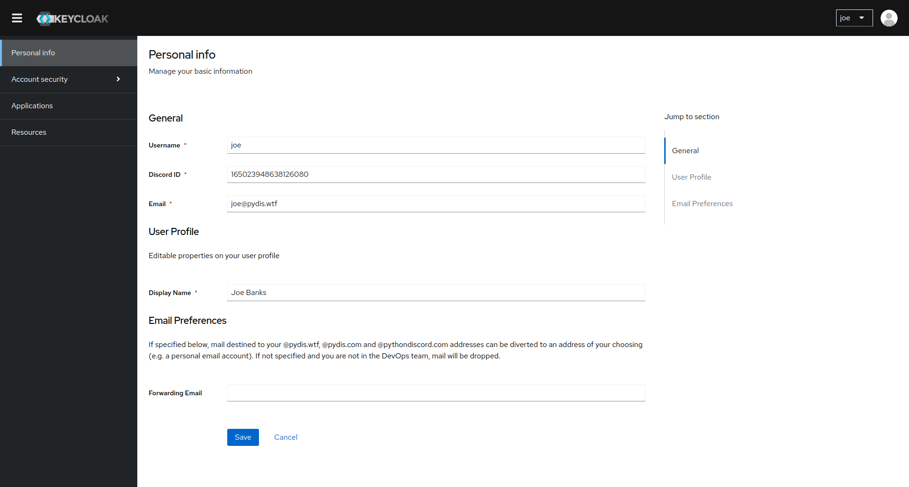

# Keycloak

Keycloak is an open source Identity and Access Management solution aimed at
modern applications and services.

In our configuration, Keycloak is not a store of user data, but rather a way to
authenticate users against our LDAP server.

Keycloak achieves the following:
- Translates web-compatible authentication mechanisms such as SAML and OpenID
  Connect to LDAP
- Provides a web interface for users to manage their own accounts

## User

Users are able to manage their own accounts through the Keycloak web interface.
This includes changing their password, enabling two-factor authentication,
managing their sessions and updating their mailing preferences.

Users can access the Keycloak interface at [id.pydis.wtf](https://id.pydis.wtf).

Keycloak fetches user data from our LDAP server, so any changes made in Keycloak will be reflected in LDAP and vice versa.  

<figure markdown="span">
  { loading=lazy }

  <figcaption>The self-service administration panel presented to users allowing
  them to update certain account fields.</figcaption>
</figure>

Users are bootstrapped into Keycloak and LDAP via Discord, read more about the
Discord bootstrap process [here](../discord-ldap.md).

## DevOps Team

### Deployment Information

Keycloak is deployed to Kubernetes in the `tooling` namespace. It stores data in
the `keycloak` PostgreSQL database.

As of now, we use the base image for Keycloak, though in future we may look at
creating a custom image to include our own custom themes.

### User Federation

As mentioned above, Keycloak does not store any user information. Instead we use
the LDAP user federation features to authenticate users against our LDAP server.

Keycloak is configured with it's own user which has certain permissions such as
the ability to query user information and reset user passwords, it syncs all
users into the Keycloak database and keeps user groups and metadata up to date
with the LDAP source.

### Maintenance

!!! warning "Unfinished Documentation"

    This section is currently unfinished. Please refer to the [Keycloak
    Documentation](https://www.keycloak.org/documentation.html) for more
    information.
