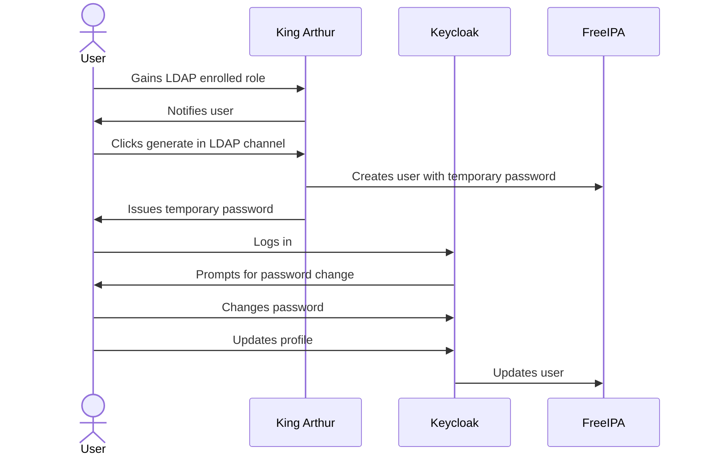

# LDAP & Discord

This document describes the process of bootstrapping users into our LDAP server
via Discord. The creation of accounts is entirely automated and controlled by
King Arthur.

## Bootstrapping

1. A user gains a role in Discord that requires LDAP access.
1. King Arthur detects this role change and notifies the user to start the
   bootstrapping process.
1. The user visits the `#ldap` channel and clicks the generate button, they are
   issued with a temporary password.
1. The user logs into [Keycloak](https://id.pydis.wtf) using their issued
   `@pydis.wtf` address and the temporary password.
1. The user is prompted to change their password and update their profile,
   including email forwarding preferences.

As a sequence diagram, the process looks something like this:

## Self-Service Password Reset

Users can reset their LDAP password at any time by visiting the `#ldap` channel
in Discord and clicking the reset button. This will issue them with a new
temporary password in the same way the bootstrapping process does.

## Continuous Synchronization

King Arthur continuously synchronizes user data between Discord and LDAP. This
adds and removes users from group memberships as necessary.

If a user no longer has a role which requires LDAP access, King Arthur will
deactivate their LDAP account.

The LDAP synchronization process runs every 10 minutes, or whenever a role
change is detected on a staff account.

You can view what King Arthur is attempting to synchronize by running the `M-x
ldap sync` command, which will return a diff of users to add, remove, or update.
