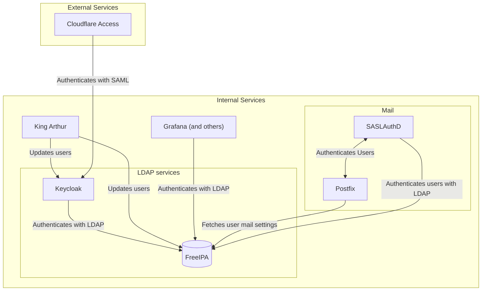

# Overview

This document describes the LDAP setup for Python Discord. We use LDAP to manage
user accounts and permissions for our services.

We deploy several services to manage our LDAP, a brief overview of how they
interact is shown below:

## Services

LDAP services are provided by:

- [FreeIPA](components/freeipa.md)
- [Keycloak](components/keycloak.md)
