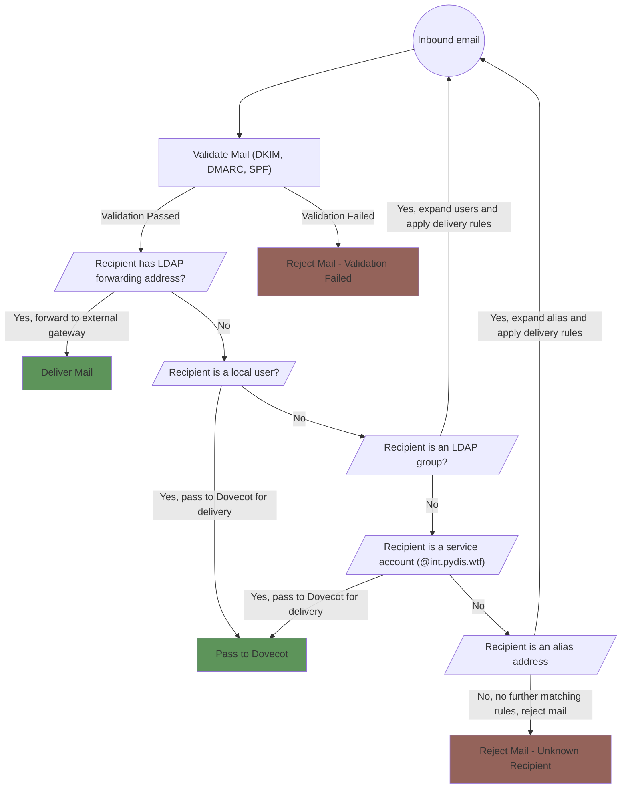
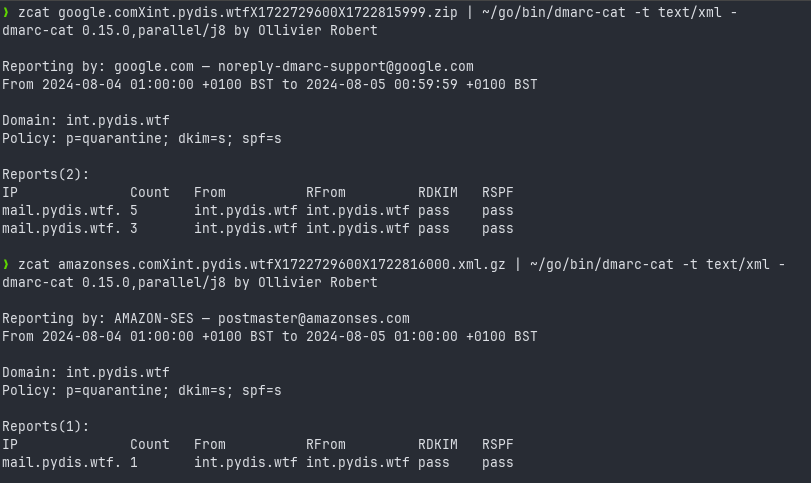

# Postfix

This document describes the Postfix setup for Python Discord.

We use Postfix for sending and receiving mail in the following ways:

- Mail destined for mailboxes is passed to Dovecot for local delivery
- Mail destined for users with forwarding preferences set in LDAP is forwarded
  to the external mail gateways
- Mail from services is sent to the external mail gateways for delivery

Mail can be destined for individual users or LDAP groups.

We use virtual alias maps in Postfix to trickle down mail to the correct
destination. An overview of our maps is shown below:



## SASL Authentication

Users authenticate via Postfix using SASL. We hand off to Dovecot to perform the
SASL authentication against the LDAP database.

SASL is available on either of the 465 or 587 SMTP ports.

## Maintenance

### Diagnosing Routing

You can use the `postmap -q` command to view how Postfix will route a specific
email based on the given table (LDAP or hash).

```
joe@lovelace:~$ sudo postmap -q dmarc@int.pydis.wtf ldap:/etc/postfix/ldap-service-mail.cf
dmarc@localhost
joe@lovelace:~$ sudo postmap -q joe@pydis.wtf ldap:/etc/postfix/ldap-registeredaddress.cf
joe@jb3.dev
```

Refer to the above flowchart to understand the priorities with which Postfix
will route mail.

### Managing the mail queues

Postfix has a number of queues that mail can be placed in. The most common
queues are:

| Queue Name | Description                                                                                                    | Suffix in `postqueue` |
| ---------- | -------------------------------------------------------------------------------------------------------------- | --------------------- |
| `active`   | Mail that is currently being delivered                                                                         | `*`                   |
| `hold`     | Mail is in a holding queue, it will not be delivered until permitted or rejected by the administrator          | `!`                   |
| `expire`   | Mail that has been forced to expire and will be returned to the sender, this can be triggered with `postsuper` | `#`                   |

You can view mail currently in the queue using `sudo postqueue -p`.

```bash
joe@lovelace:~$ sudo postqueue -p
-Queue ID-  --Size-- ----Arrival Time---- -Sender/Recipient-------
033FCE000E!     796 Sun Aug  4 19:46:59  joe@pydis.wtf
                                         joe@jb3.dev
                                         dmarc+failures@localhost

-- 0 Kbytes in 1 Request.
```

To manage the queues, you can use the following commands:

```bash
$ # Permit a message in the hold queue
$ sudo postsuper -H <queue_id>

$ # Delete a message from the queue
$ sudo postsuper -d <queue_id>
```

Note, you should remove the symbol from the end of the queue ID when using
`postsuper` (e.g. remove the `!` for the hold queue).

### Viewing DMARC reports

!!! warning "Outdated section"

    This section was written before the move to IMAP and Dovecot provided mail
    directories. It will require updating to factor in that we no longer use
    mailbox files.

DMARC reports are delivered into the `/var/mail/dmarc` mailbox. You can quickly
get an overview of the reports using `neomutt`

```bash
$ sudo -u postfix neomutt -f /var/mail/dmarc
```

DMARC aggregate reports are sent to the `dmarc+reports@pydis.wtf` address. Using
some bash scripting, you can filter the `/var/mail/dmarc` folder for these
messages and extract the attachments for further processing.

```bash
#!/bin/bash

# Define paths
MAILFILE="/var/mail/dmarc"
TEMP_DIR="/tmp/dmarc_attachments"
EMAIL_FILTERED="/tmp/dmarc_emails"

# Create temporary directory for attachments
mkdir -p $TEMP_DIR

# Filter emails destined for dmarc+reports@int.pydis.wtf and save to a temporary file
grep -i -E "^(To|X-Original-To): dmarc\+reports@int\.pydis\.wtf" -A 100000 $MAILFILE > $EMAIL_FILTERED

# Split the filtered emails into individual messages and process each with munpack
csplit -f "$TEMP_DIR/email_" -b "%04d.msg" $EMAIL_FILTERED '/^From /' '{*}'

# Change to the temporary directory
cd $TEMP_DIR

# Extract attachments from each individual email
for email in email_*.msg; do
    munpack -q < $email

    # Remove the .msg file
    rm $email

    # Remove any .desc files generated by munpack
    rm -f *.desc
done

echo "Attachments have been extracted to $TEMP_DIR"
```

Once you have run this with `sudo ./script.sh`, you can navigate to the
`/tmp/dmarc_attachments` folder to view reports.

Using a tool like [dmarc-cat](https://github.com/keltia/dmarc-cat) you can
reprocess these reports into a usable format.

<figure markdown="span">
  { loading=lazy }
  <figcaption>Viewing the reports generated by the above script with `dmarc-cat`</figcaption>
</figure>
