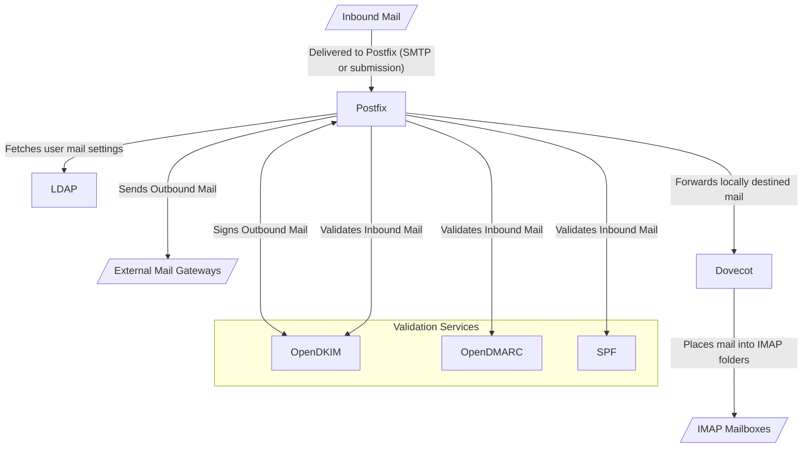

# Overview

This document describes the email setup for Python Discord.

Email has the following use-cases for Python Discord:

- Sending service mail to users such as password resets and notifications
- Providing forwarding mail for individual users who do not wish to expose their
  personal email addresses
- Providing forwarding mail for teams within staff (e.g. administrators, events
  team)

An overview of our email setup is shown below:

Find an overview of the services we use for email below:

- [Postfix](components/postfix.md)
- [LDAP](../LDAP/index.md)
- [OpenDKIM, OpenDMARC & SPF validation](components/validation.md)
- [DKIM signing](components/signing.md)
- [Dovecot](components/dovecot/index.md)
